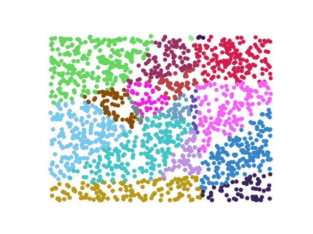

# mannr
<p >
  
</p>
mannr is a lightweight, single-file Python package that implements a randomized approximate nearest neighbor (ANN) tree for tabular data using Pandas and NumPy.
It focuses on simplicity and offline experimentation rather than production-grade performance.

The package recursively partitions data using randomly sampled hyperplanes, producing a binary tree whose leaves contain small subsets of the original dataset.

## Features

- Single-file Python module (no package directory)
- Randomized ANN tree construction
Works directly with Pandas DataFrames
- Supports arbitrary numeric feature subsets
- Simple tree and node abstraction

## Installation

Clone the repository and install locally:
```bash
pip install .
```

Or install in editable mode for development:
```bash
pip install -e .
```


Since this is a single-file module, installation uses py_modules instead of packages.

## Dependencies

The core functionality requires:

- Python 3.8+
- pandas
- numpy

## Project Structure
```bash
.
├── mannr.py
├── setup.py
└── README.md
```
## Core Concepts
ANN Tree Construction

The tree is built recursively using a random hyperplane split:

1. Two rows are randomly sampled from the dataset.

2. Their midpoint defines a center.

3. The vector between them defines a hyperplane.

4. All points are split based on which side of the hyperplane they lie on.

5. Recursion continues until the subset size is ≤ k.

This approach is inspired by randomized ANN methods such as RP-trees.
## Notes

A node is considered a leaf if at least one child is missing.

Traversal uses a queue (collections.deque).

**Intended for debugging or exploration, not analysis**

## Example Usage
```python
import pandas as pd
from mannr import gen_ann_tree, find_leaves

df = pd.read_csv("data.csv")
features = ["x", "y"]

root = gen_ann_tree(df, features, k=20)
leaves = find_leaves(root)
```

